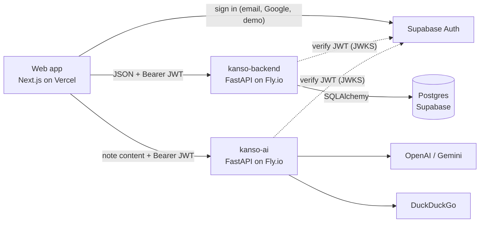

# kanso

**Tasks, notes and habits in one calm place.** kanso (簡素, "simplicity") plans your day, keeps your notes, tracks your streaks, and tells you what to focus on next.

**Live app: [kanso-web-app.vercel.app](https://kanso-web-app.vercel.app)**. Click **Try the demo** to open a private sandbox with sample data. No signup needed.

This repository is the web app. kanso is three services, each in its own repository:

| Repository | What it is | Stack | Hosting |
|---|---|---|---|
| **kanso-frontend** (this repo) | Web app | Next.js 16, React 19, TypeScript, Tailwind CSS v4, Tiptap | Vercel |
| [kanso-backend](https://github.com/LuisFVillalon/kanso-backend) | JSON API and data layer | FastAPI, SQLAlchemy 2, Alembic, Postgres (Supabase) | Fly.io |
| [kanso-ai](https://github.com/LuisFVillalon/kanso-ai) | Learning-resource recommendations | FastAPI, OpenAI or Gemini, DuckDuckGo search | Fly.io |

## Features

- **Tasks**: due dates and times, priorities, tags, time estimates, and a filterable, sortable list.
- **Notes**: a Tiptap rich-text editor with tables, highlights, resizable images and text alignment, organized by tag folders in grid or list view. Notes export to PDF, and editing time is tracked per note.
- **Learning resources (AI)**: from any note, get one video, one article and one exercise for going deeper. An LLM reads the note and plans the searches, then real search results are filtered, dead-link-checked and ranked by deterministic code, so the model never invents a link.
- **Habits**: daily check-ins, current and best streaks, and a 30-day history you can edit retroactively.
- **Daily debrief**: overdue work, what's due today, whether today's plan fits your available hours, and a short "focus next" list. It's rule-based on the backend; no LLM is involved.
- **Big-picture calendar**: a year and month view of tasks, habits and notes, plus a term tracker with a countdown.
- **Customizable dashboard**: drag-and-drop, resizable stats widgets; accent colors; notebook page styles; focus mode; and a doodle canvas.
- **Accounts**: email/password (with a NIST-style password policy) or Google sign-in, plus account settings and account deletion.

## Architecture



- Supabase is used **only for authentication**. All data goes through the FastAPI backend, which verifies the Supabase JWT on every request and scopes every query to the token's user. The database's auto-generated REST API is locked down, so the public Supabase key grants no data access.
- The AI service is separate from the backend so the slow, rate-limited LLM and search path can't tie up the main API's workers. It verifies the same JWT and rate-limits each user.

## Engineering notes

A few decisions worth calling out:

- **A private sandbox per demo visitor.** "Try the demo" signs in with a Supabase *anonymous* user, then the backend seeds that user with sample data dated relative to the visitor's local day. Visitors never share an account, and the backend deletes sandboxes after a day. `AuthContext` keeps data loading paused until the seed finishes, so the dashboard never flashes an empty sandbox.
- **Timezone-correct "today."** The server runs in UTC, but habits and the daily debrief care about the user's calendar day. Those endpoints take the caller's `local_date` and `local_time` instead of trusting the server clock (`utils/dateUtils.ts`).
- **Shared data without refetching.** `AppDataProvider` mounts the task, tag, habit and note stores once in the root layout, so data survives client-side navigation. They're four separate contexts, so typing in a note doesn't re-render the calendar.
- **Local-first, backend-authoritative preferences.** Theme, layout and view settings render instantly from `localStorage`, then yield to the saved profile once it loads. Inline scripts in `layout.tsx` apply the theme before first paint to prevent flashes.
- **Errors surface as toasts.** Failed saves roll back optimistic updates and show the server's reason when it has a user-facing one (for example, a duplicate tag name).

## Project structure

```
src/app/
  page.tsx               # Landing page when signed out, dashboard (TaskManager) when signed in
  TaskManager.tsx        # The dashboard
  notes/ calendar/       # /notes and /calendar pages
  login/ signup/ auth/callback/
  error.tsx not-found.tsx opengraph-image.tsx
  components/            # Grouped by domain: task, notes, habit, calendar, stats, settings,
                         # landing, doodle, tag, auth; plus common/ and layout/ (cross-domain)
  context/               # Auth, Toast, and the Tasks/Tags/Habits/Notes data providers
  hooks/                 # Data hooks (useTasksAndTags, useNotes, useHabits, useProfile, ...)
  lib/backend-api.ts     # Every backend and AI-service request, with auth headers and typed errors
  lib/supabase.ts        # Supabase client (auth only)
  utils/                 # Date helpers, note-content extraction for the AI service, ...
```

## Running locally

Requires Node.js 20.9 or newer, plus running instances of [kanso-backend](https://github.com/LuisFVillalon/kanso-backend) and (for learning resources) [kanso-ai](https://github.com/LuisFVillalon/kanso-ai).

```bash
npm install
cp .env.example .env.local   # then fill in the values
npm run dev                  # http://localhost:3000
```

| Variable | Description |
|---|---|
| `NEXT_PUBLIC_KANSO_API_URL` | Base URL of kanso-backend (e.g. `http://localhost:8000`) |
| `NEXT_PUBLIC_KANSO_AI_URL` | Base URL of kanso-ai (e.g. `http://localhost:8080`) |
| `NEXT_PUBLIC_SUPABASE_URL` | Supabase project URL |
| `NEXT_PUBLIC_SUPABASE_ANON_KEY` | Supabase publishable (anon) key |
| `NEXT_PUBLIC_SITE_URL` | Optional. Canonical production URL, used for OAuth redirects and link previews |

For "Try the demo" to work, the Supabase project needs **Anonymous sign-ins** enabled (Authentication → Sign In / Providers).

| Script | Description |
|---|---|
| `npm run dev` | Development server |
| `npm run build` / `npm start` | Production build / serve it |
| `npm run lint` | ESLint (Next.js core-web-vitals + TypeScript rules) |

## Author

Luis Fernando Villalon, San Diego State University. [github.com/LuisFVillalon](https://github.com/LuisFVillalon)
